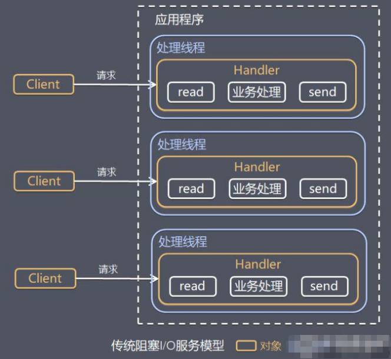
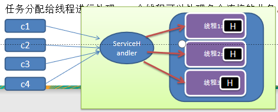
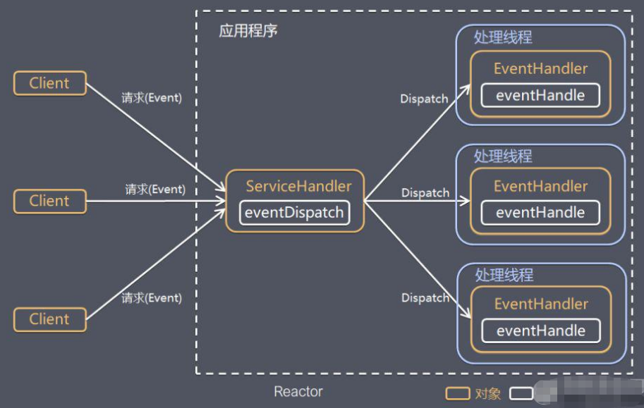
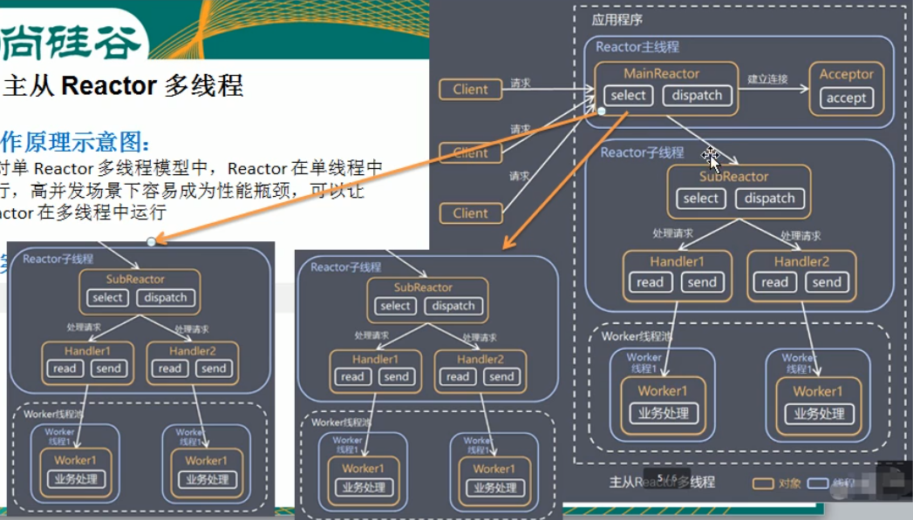

### 线程模型的基本介绍
```text
1) 不同的线程模式，对程序的性能有很大影响，为了搞清Netty线程模型，我们来系统的讲解下各个线程的模式，最后看看Netty线程模型有什么优势。
2) 目前存在的线程模型有    
    传统阻塞I/O服务模型
    Reactor模式
3) 根据Reactor的数量和处理资源池线程的数量不同，有3种典型的实现
    单Reactor单线程
    单Reactor多线程
    主从Reactor多线程
4) Netty线程模式(Netty主要基于主从Reactor多线程模型做了一个的改进，其中主Reactor多线程模型有多个Reactor)
```

### 传统阻塞I/O服务模型
```text
工作原理图，见下方
    黄色的框表示对象，蓝色的框表示线程，白色的框表示方法(API)
模型特点
    1) 采用阻塞I/O模式获取输入的数据
    2) 每个连接都需要独立的线程完成数据的输入，业务的处理，数据的返回
问题分析    
    1) 当并发数很大，就会创建大量的线程，占用很大的系统资源。
    2) 连接创建后，如果当前线程暂时没有数据可读，该线程会阻塞在read操作，造成线程资源的兰妃。
```


### Reactor模式
```text
针对传统阻塞I/O服务模型的2个缺点，解决方案：    
    1) 基于I/O复用模型：多个连接共用一个阻塞对象，应用程序只需要对一个阻塞对象等待，无需阻塞等待
    所有连接。当某个连接有新的数据可以处理时，操作系统通知应用程序，线程从阻塞状态返回，开始进行业务处理。
    Reactor对应的叫法：a、反应器模式。b、分发者模式(Dispatcher)。c、通知者模式。
    2) 基于线程池服用线程资源：不必再为每个连接创建线程，将连接完成后的业务处理任务分配给线程进行处理，一个
    线程可以处理多个连接的业务。
```
  
```text
I/O复用结合线程池，就是Reactor模式的基本设计思想
1) Reactor模式，通过一个或多个输入同时传递给服务处理器的模式(基于事件驱动)
2) 服务器端程序处理传入的多个请求，并将他们呢同步分派给相应的处理线程。因此Reactor模式也叫Dispatcher模式
3) Reactor模式使用I/O复用监听事件，收到事件后，分发给某个线程(进程)，这里就是网络服务器高并发处理关键。
```

```text
Reactor模式中的核心组成：
    1) Reactor：Reactor在一个单独线程中运行，负责监听和分发事件，分发给适当的处理程序来对I/O事件
    做出反应。它就像公司的电话接线员，它接听来自客户的电话并将线路转移到适当的联系人。
    2) Handlers: 处理程序执行I/O事件要完成实际事件，类似于客户想要与之交谈的公司中的实际工作人员。
    Reactor通过调度适当的处理程序来响应I/O事件，处理程序执行非阻塞操作。
```
### Reactor 3种线程模型
#### 单Reactor单线程

```text
工作原理见示意图：
    通过演示NIO群聊，说明
   
GroupChatServer 
    当前服务器的监听线程为：main
    。。。
    /127.0.0.1:64897上线了
    等待新时间。。。
    /127.0.0.1:64911上线了
    等待新时间。。。
    /127.0.0.1:64924上线了
    。。。
    from 客户端： 127.0.0.1:64897说：hello100                                                                                                                                                                                                                                                                                                                                                                                                                                                                                                                                                                                                                                                                                                                                                                                                                                                                                                                                                                                                                                   
    当前服务器的处理线程为：main
    服务器转发消息中。。。
    。。。
    from 客户端： 127.0.0.1:64911说：hello200                                                                                                                                                                                                                                                                                                                                                                                                                                                                                                                                                                                                                                                                                                                                                                                                                                                                                                                                                                                                                                   
    当前服务器的处理线程为：main
    服务器转发消息中。。。
    。。。
    from 客户端： 127.0.0.1:64924说：hello300                                                                                                                                                                                                                                                                                                                                                                                                                                                                                                                                                                                                                                                                                                                                                                                                                                                                                                                                                                                                                                   
    当前服务器的处理线程为：main
    服务器转发消息中。。。
    
GroupChatClient 127.0.0.1:64897
    hello100

GroupChatClient 127.0.0.1:64911
    hello200
    
GroupChatClient 127.0.0.1:64924
    hello300
    
方案说明：    
    1) select是前面I/O复用模型介绍的标准网络编程API，可以实现应用程序通过一个阻塞对象监听多路连接请求。
    2) Reactor对象通过select监听客户请求事件，收到事件后通过Dispatcher进行分发。
    3) 如果是建立连接的请求事件，则有Acceptor通过accept处理连接请求，然后创建一个Handler对象处理连接
    完成后的后续业务逻辑。
    4) 如果不是建立连接的事件，则Reactor会分发调用连接对应的Handler来响应。
    5) Handler会完成Read-->业务处理-->Send的完整业务流程。
    
结合实例：服务器端用一个线程通过多路复用搞定所有的 IO 操作（包括连接，读、写等），编码简单，清晰明了，
但是如果客户端连接数量较多，将无法支撑，前面的 NIO案例就属于这种模型。
```

#### 单Reactor多线程

```text
工作原理示意图如上：
方案说明：    
    1) Reactor对象通过select监控客户端请求事件，收到事件后，通过dispatch进行分发。
    2) 如果是建立连接请求，则由Acceptor的accept方法处理连接请求，然后创建一个Handler对象处理完成连接后的
    各种事件。
    3) 如果不是建立连接请求，则由Reactor分发调用跟这个连接关联的Handler来处理
    4) Handler只负责响应事件，不做具体的业务处理。通过read方法读取数据后，会分发给后面的worker线程池中的某个线程
    处理业务逻辑。
    5) Worder线程池会分配独立线程完成真正的业务逻辑，并将结果返回给对应的handler.
    6) Handler收到响应后，通过send将结果返回给Client。
    
方案优缺点：    
    1) 优点：可以充分的利用多核cpu的处理能力(多线程)
    2) 缺点：多线程数据共享和访问比较复杂。reator处理所有事件的监听和响应，在单线程运行
    在高并发的应用场景容易出现性能瓶颈。
```
#### 主从Reactor多线程
  

```text
工作原理示意图如上：    
    针对单Reactor多线程模型中，Reactor在单线程中运行，在高并发场景下容易成为性能瓶颈，可以让
    Reactor在多线程下运行。
方案说明：
    1) Reactor主线程MainReactor对象通过select监听连接事件，收到事件后，通过Acceptor处理连接事件。
    2) 当Acceptor处理连接事件后，MainReactor将连接分配给SubReactor
    3) SubReactor将连接加入到连接队列进行监听，并创建Handler进行各种事件处理。
    4) 当有新事件发生时，SubReactor就会调用对应的Handler处理
    5) Handler通过read方法读取数据，分发给后面的Worker线程池处理。
    6) Worker线程池分配独立的worker线程进行业务处理，并返回结果。
    7) Handler收到响应的结果后，再通过send将返回的结果返回给Client
    8) Reactor主线程可以对应多个SubReactor子线程。
方案的优缺点说明：
    1) 优点：父线程与子线程的数据交互简单，职责明确，父线程只需要接收新连接，子线程完成后续的业务处理
    2) 有点：父线程与子线程的数据交互简单，Reactor主线程只需要把新连接传给子线程，子线程无需返回数据。
    3) 缺点：编程复杂度高。
结合实例：
    这种模型在许多项目中广泛使用，包括Ngnix主从Reactor多线程模型，Memcached主从多线程，Netty主从多线程
    模型的支持。
```
### Reactor模式小结
```text
3种模式用生活案例来理解
    1) 单Reactor单线程：前台接待员和服务员都是同一个人，全程为顾客服务。
    2) 单Reactor多线程：1个前台接待员，多个服务员，接待员只负责接待。
    3) 主从Reactor多线程，多个前台接待员，多个服务员。
Reactor模式具有如下优点：
    1) 响应快，不必为单个同步事件所阻塞，虽然Reactor本身依然是同步的。
    2) 可以最大程度的避免复杂的多线程及同步问题，并且避免了多线程/进程的切换开销。
    3) 扩展性好，可以方便的通过增加Reactor实例个数来充分利用CPU资源。
    4) 复用性好，Reactor模型本身与事件处理模型逻辑无关，具有很高的复用性。
```
