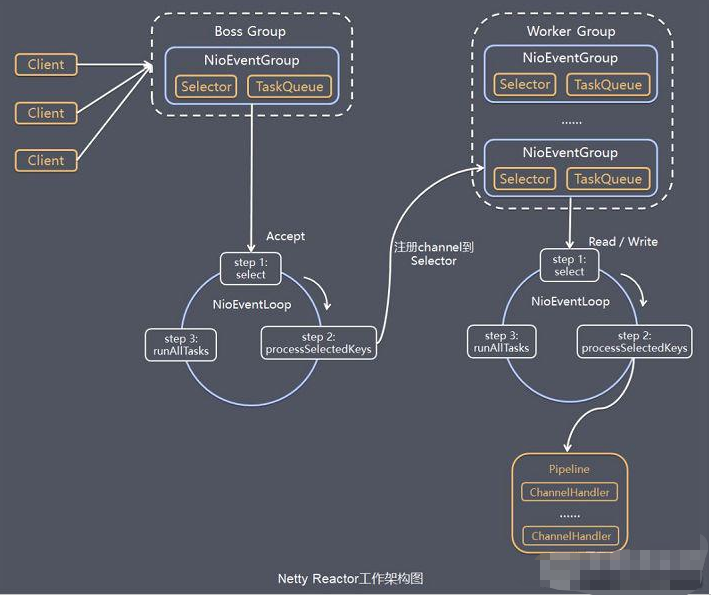

### Netty模型--简单版
  
```text
工作原理示意图：
    Netty主要基于主从Reactors多线程(如上图)做了一定的改进，其中主从Reactor多线程模型有多个Reactor。
机制梳理：
    1) BossGroup线程维护Selector，只关注Accept
    2) 当接收到accept事件，获取到对应的SocketChannel，封装成NIOSocketChannel并注册到Worker线程(作用：事件循环)，并进行维护。
    3) 当Worker线程监听到Selector中注册的通道发生感兴趣的事件后，就进行处理(就由Handler处理)，注意Handler已经加入到通道。  
```

### Netty模型--进阶版
  
```text
工作原理示意图(如上图)
    Netty主要基于主从Reactors多线程模型做了一定改进，其中主从Reactor多线程模型中有多个Reactor。
```

### Netty模型--详细版
  
```text
工作原理示意图(见上图)
    1) Netty抽象出两组线程池，BossGroup专门负责接收客户端的连接，WorkerGroup专门负责网络的读写。
    2) BossGroup和WorkerGroup类型都是NIOEventLoopGroup
    3) NIOEventLoopGroup相当于一个事件循环组，这个组中含有多个事件循环，每个事件循环是NIOEventLoop。
    4) NIOEventLoop表示一个不断循环执行处理任务的线程。每个NIOEventLoop都有一个Selector对象，用于监听
    绑定在其上的socket的网络通讯。
    5) NIOEventLoopGroup可以有多个线程，即可以含有多个NIOEventLoop。
    6) 每个Boss NIOEventLoop执行步骤有3步
        6.1) 轮询accept事件
        6.2) 处理accept事件,与client建立连接，生成NIOSocketChannel，并将其注册到某个Worker NIOEventLoop
        的Selector上。
        6.3) 处理任务队列中的任务，即runAllTasks。
    7) 每个Worker NIOEventLoop循环执行的步骤。
        7.1) 轮询read，write事件。
        7.2) 处理I/O事件，即read、write事件，在对应的NIOSocketChannel中处理。
        7.3) 处理任务队列的任务，即runAllTasks。
    8) 每一个Worker NIOEventLoop在处理业务时，会使用pipeline(管道)，pipeline中包含channel，即通过pipeline可以
    获取到对应的通道，管道中维护了很多处理器。
```

### EventLoopGroup线程数
```text
默认线程数是由NettyRuntime.availableProcessors() * 2决定(系统CPU的核数*2)
```

  
### EventLoopGroup Worker线程是怎么分配的？
```text
Worker线程将8个线程依次分配，分配完之后从头开始再分配。
--------服务器 is ready-------
服务器读取线程： nioEventLoopGroup-3-1
Server ctx: ChannelHandlerContext(NettyServerHandler#0, [id: 0x70366a64, L:/127.0.0.1:6668 - R:/127.0.0.1:64978])
客户端发送来的消息是：hello, 服务器, 客户端的地址是： /127.0.0.1:64978
服务器读取线程： nioEventLoopGroup-3-2
Server ctx: ChannelHandlerContext(NettyServerHandler#0, [id: 0x0391d905, L:/127.0.0.1:6668 - R:/127.0.0.1:65023])
客户端发送来的消息是：hello, 服务器, 客户端的地址是： /127.0.0.1:65023
服务器读取线程： nioEventLoopGroup-3-3
Server ctx: ChannelHandlerContext(NettyServerHandler#0, [id: 0xe7390aca, L:/127.0.0.1:6668 - R:/127.0.0.1:65056])
客户端发送来的消息是：hello, 服务器, 客户端的地址是： /127.0.0.1:65056
服务器读取线程： nioEventLoopGroup-3-4
Server ctx: ChannelHandlerContext(NettyServerHandler#0, [id: 0xbf993d1a, L:/127.0.0.1:6668 - R:/127.0.0.1:65093])
客户端发送来的消息是：hello, 服务器, 客户端的地址是： /127.0.0.1:65093
服务器读取线程： nioEventLoopGroup-3-5
Server ctx: ChannelHandlerContext(NettyServerHandler#0, [id: 0xaa8bfdeb, L:/127.0.0.1:6668 - R:/127.0.0.1:65118])
客户端发送来的消息是：hello, 服务器, 客户端的地址是： /127.0.0.1:65118
服务器读取线程： nioEventLoopGroup-3-6
Server ctx: ChannelHandlerContext(NettyServerHandler#0, [id: 0xcf9ef012, L:/127.0.0.1:6668 - R:/127.0.0.1:65143])
客户端发送来的消息是：hello, 服务器, 客户端的地址是： /127.0.0.1:65143
服务器读取线程： nioEventLoopGroup-3-7
Server ctx: ChannelHandlerContext(NettyServerHandler#0, [id: 0x2e9d50c3, L:/127.0.0.1:6668 - R:/127.0.0.1:65172])
客户端发送来的消息是：hello, 服务器, 客户端的地址是： /127.0.0.1:65172
服务器读取线程： nioEventLoopGroup-3-8
Server ctx: ChannelHandlerContext(NettyServerHandler#0, [id: 0xa6b8840f, L:/127.0.0.1:6668 - R:/127.0.0.1:65214])
客户端发送来的消息是：hello, 服务器, 客户端的地址是： /127.0.0.1:65214
服务器读取线程： nioEventLoopGroup-3-1
Server ctx: ChannelHandlerContext(NettyServerHandler#0, [id: 0xe733053b, L:/127.0.0.1:6668 - R:/127.0.0.1:65248])
客户端发送来的消息是：hello, 服务器, 客户端的地址是： /127.0.0.1:65248
```
### Channel与Pipeline的关系？
  

```text
ctx对象中持有Channel和Pipeline的引用，Channel对象和Pipeline对象相互持有对方的引用。
```

### Netty模型中的TaskQueue任务队列

作用：在pipeline的某个handler中存在耗时操作时，此时我们就可以将耗时任务提交到TaskQueue中异步执行。

```text
任务队列中的Task有3种典型的使用场景
    1) 用户程序自定义的普通任务。该任务提交到taskQueue。
    2) 用户自定义的定时任务。该任务提交到scheduleTaskQueue中。
    3) 非当前Reactor线程调用Channel的各种方法。
        例如：在推送系统的业务线程里面，根据用户的标识，找到对应的Channel引用，然后调用
        Write类方法向该用户推送消息，就会进入到这种场景。最终的Write会提交到任务队列中
        后被异步消费。
```
### Netty模型方案再说明
```text
1) Netty抽象出两组线程池，BossGroup专门负责接收客户端连接，WorkerGroup专门负责网络读写操作。
2) NioEventLoop表示一个不断循环执行处理任务的线程，每个NioEventLoop都有一个selector，用于监听
绑定在其上的socket网络通道。
3) NioEventLoop内部采用串行化设计，从消息的读取-->解码-->处理-->编码-->发送，始终由IO线程
NioEventLoop负责。
    NioEventLoopGroup下包含多个NioEventLoop(NioEventLoopGroup与NioEventLoop是一对多关系)
    每个NioEventLoop中包含有一个Selector，一个taskQueue(NioEventLoop与Selector、TaskQueue是一对一关系)
    每个NioEventLoop的Selector上可以注册监听多个NioChannel(Selector与NioChannel是一对多关系)
    每个NioChannel只会绑定在唯一的NioEventLoop上
    每个NioChannel都绑定有一个自己的ChannelPipeline(NioChannel与ChannelPipeline是一对一关系)
```

### Netty I/O操作的异步模型
#### 异步模型基本介绍
```text
1) 异步的概念和同步相对：当一个异步过程调用发出后，调用者不能立刻得到结果。实际处理这个调用
的组件在完成后，通过状态、通知、回调来通知调用者。
2) Netty中的I/O操作时异步的，包括Bind、Write、Connect等操作会简单的返回一个ChannelFuture。
3) 调用者并不能立刻获得结果，而是通过Future-Listener机制，用户可以方便的主动获取或者通过通知
机制获取IO操作结果。
4) Netty的异步模型时建立在future和callback之上的。callback就是回调。重点说Future，它的核心思想
是：假设一个方法fun，计算过程可能非常耗时，等待fun返回显然不合适。那么可以在调用fun的时候，立马
返回一个Future，后续可以通过Future去监控方法fun的处理过程(即：Future-Listener机制)
```
#### Future说明
```text
1) 表示异步的执行结果，可以通过它提供的方法来检测执行是否完成，比如检索、计算等等。
2) ChannelFuture是一个接口，我们可以添加监听器，当监听的事件发生后，就会通知到监听器。
案例说明。
```
#### 异步模型(工作原理示意图)

```text
说明：
    1) 在使用Netty进行编程时，拦截操作和转换出入栈数据只需要你提供callback或利用future即可。
    这使得链式操作简单、高效，并有利于编写可重用的、通用的代码。
    2) Netty框架的目标就是让你的业务逻辑从网络基础应用编码中分离出来、解脱出来。
Future-Listener机制
    1) 当Future对象刚刚创建时，处于非完成状态，调用者可以通过返回的ChannelFuture来获取操作执行
    的状态，注册监听函数来执行完成后的操作。
    2) 常见有如下操作
        通过isDone方法来判断当前操作是否完成。
        通过isSuccess方法来判断已完成的当前操作是否成功。
        通过getCause方法来获取已完成的当前操作失败的原因。
        通过isCancelled方法来判断已完成的当前操作是否已经取消。
        通过addListener方法来注册监听器，当操作已完成(isDone方法返回完成)，将会通知指定的监听器;
        如果Future对象已完成，则通知指定的监听器。
    3) 举例说明
        演示：绑定端口是异步操作，当绑定操作处理完，将会调用相应的监听器处理逻辑
        serverBootstrap.bind(port).addListener(future -> {
           if(future.isSuccess()) {
               System.out.println(newDate() + ": 端口["+ port + "]绑定成功!");
           } else{
               System.err.println("端口["+ port + "]绑定失败!");
           }
       });
        小结：相比传统阻塞 I/O，执行 I/O 操作后线程会被阻塞住, 直到操作完成；异步处理的好处是不会造成
        线程阻塞，线程在 I/O 操作期间可以执行别的程序，在高并发情形下会更稳定和更高的吞吐量
```

#### PS

># netty 中 ChannelFuture.sync () 的作用是什么？
>
>https://gorden5566.com/post/1066.html