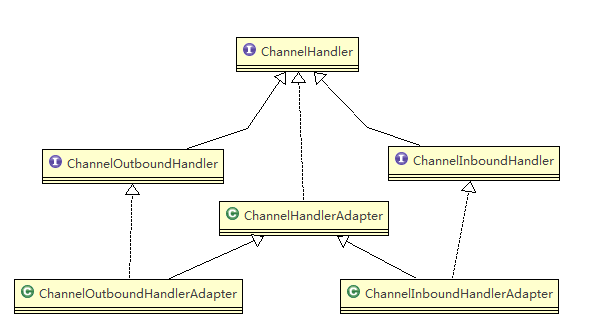
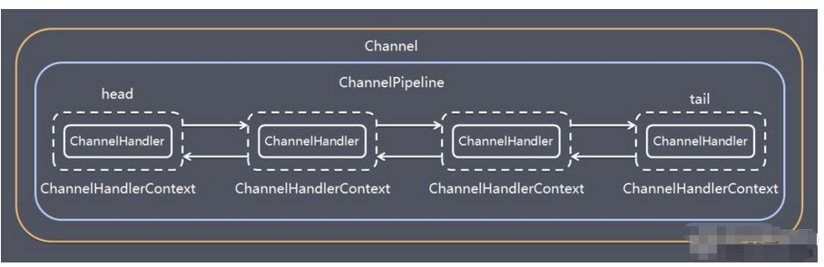
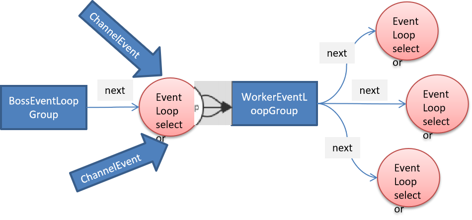
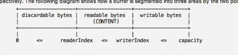

### Bootstrap、SererBootstrap
```text
1) Bootstrap意思是引导，一个Netty应用通常由一个Bootstrap开始，主要作用是配置整个Netty程序，串联各个
组件，Netty中Bootstrap类是客户端程序的启动引导类，ServerBootstrap是服务端启动的引导类。
2) 常见的方法由
    // 该方法用于服务器端，用来设置两个EventLoop
    public ServerBootstrap group(EventLoopGroup parentGroup, EventLoopGroup childGroup)
    // 该方法用于客户端，用来设置一个EventLoop
    public ServerBootstrap group(EventLoopGroup group)
    // 该方法用来设置一个服务器端的通道实现
    public B channel(Class<? extends C> channelClass)
    // 用来给ServerChannel添加配置
    public <T> B option(ChannelOption<T> option, T value)
    // 用来给接收到的通道添加配置
    public <T> ServerBootstrap childOption(ChannelOption<T> childOption, T value)
    // 该方法用来设置业务处理类，用于给BossGroup添加handler
    public B handler(ChannelHandler handler)
    // 该方法用来设置业务处理类(自定义的handler)，用于给WorkerGroup添加handler
    public ServerBootstrap childHandler(ChannelHandler childHandler)
    // 该方法用于服务器端，用来设置占用的端口号
    public ChannelFuture bind(int inetPort)
    // 该方法用于客户端，用来连接服务器
    public ChannelFuture connect(String inetHost, int inetPort) 
```
### Future、ChannelFuture
```text
1) Netty 中所有的 IO 操作都是异步的，不能立刻得知消息是否被正确处理。但是可以过一会等它
执行完成或者直接注册一个监听，具体的实现就是通过Future和ChannelFuture，他们可以注册
一个监听，当操作执行成功或失败时监听会自动触发注册的监听事件。
2) 常见的方法有
    Channel channel()，返回当前正在进行 IO 操作的通道
    ChannelFuture sync()，等待异步操作执行完毕(将异步变成同步)
```
### Channel
```text
1) Netty 网络通信的组件，能够用于执行网络 I/O 操作。
2) 通过Channel 可获得当前网络连接的通道的状态
3) 通过Channel 可获得 网络连接的配置参数 （例如接收缓冲区大小）
4) Channel 提供异步的网络 I/O 操作(如建立连接，读写，绑定端口)，异步调用意味着任何I/O调用
都将立即返回，并且不保证在调用结束时所请求的 I/O 操作已完成
5) 调用立即返回一个 ChannelFuture 实例，通过注册监听器到 ChannelFuture 上，可以I/O操作成功、
失败或取消时回调通知调用方
6) 支持关联I/O操作与对应的处理程序
7) 不同协议、不同的阻塞类型的连接都有不同的Channel类型与之对应，常用的Channel类型如下：
    NioSocketChannel:异步的客户端TCP Socket连接
    NioServerSocketChannel:异步的服务器端TCP Socket
    NioDatagramChannel:异步的UDP连接
    NioSctpChannel:异步的客户端Sctp连接
    NioSctpServerChannel:异步的Sctp服务端连接，这些通道涵盖了UDP和TCP网络IO一级文件IO。
```
### Selector(Selector可以管理多个Channel)
```text
1) Netty基于Selector对象实现I/O多路复用，通过Selector一个线程可以监听多个连接的Channel事件。
2) 当向一个Selector中注册Channel后，Selector内部的机制就可以自动不断地查询(select)这些注册的
Channel是否有已就绪的I/O事件(例如可读、可写、网络连接完成等)，这样程序就可以很简单地使用一个
线程高效地管理多个Channel。
```
### ChannelHandler 及其实现类
```text
1) ChannelHandler 是一个接口，处理 I/O 事件或拦截 I/O 操作，并将其转发到其 ChannelPipeline
(业务处理链)中的下一个处理程序。
2) ChannelHandler 本身并没有提供很多方法，因为这个接口有许多的方法需要实现，方便使用期间，
可以继承它的子类
```

```text
3) ChannelHandler 及其实现类一览图(见下图) 
    ChannelInboundHandler 用于处理入站 I/O 事件。
    ChannelOutboundHandler 用于处理出站 I/O 操作。
    // 适配器
    ChannelInboundHandlerAdapter 用于处理入站 I/O 事件。
    ChannelOutboundHandlerAdapter 用于处理出站 I/O 操作。
    ChannelDuplexHandler 用于处理入站和出站事件。
4) 我们经常需要自定义一个 Handler 类去继承 ChannelInboundHandlerAdapter，然后通过重写相应
方法实现业务逻辑，我们接下来看看一般都需要重写哪些方法
public class ChannelInboundHandlerAdapter extends ChannelHandlerAdapter implements ChannelInboundHandler {

    @Override
    public void channelRegistered(ChannelHandlerContext ctx) throws Exception {
        ctx.fireChannelRegistered();
    }

    @Override
    public void channelUnregistered(ChannelHandlerContext ctx) throws Exception {
        ctx.fireChannelUnregistered();
    }

	// 通道就绪事件
    @Override
    public void channelActive(ChannelHandlerContext ctx) throws Exception {
        ctx.fireChannelActive();
    }

    @Override
    public void channelInactive(ChannelHandlerContext ctx) throws Exception {
        ctx.fireChannelInactive();
    }

	// 通道读取数据事件
    @Override
    public void channelRead(ChannelHandlerContext ctx, Object msg) throws Exception {
        ctx.fireChannelRead(msg);
    }

	// 通道读取数据完毕事件
    @Override
    public void channelReadComplete(ChannelHandlerContext ctx) throws Exception {
        ctx.fireChannelReadComplete();
    }

    @Override
    public void userEventTriggered(ChannelHandlerContext ctx, Object evt) throws Exception {
        ctx.fireUserEventTriggered(evt);
    }

    @Override
    public void channelWritabilityChanged(ChannelHandlerContext ctx) throws Exception {
        ctx.fireChannelWritabilityChanged();
    }

	// 通道发生异常事件
    @Override
    public void exceptionCaught(ChannelHandlerContext ctx, Throwable cause)
            throws Exception {
        ctx.fireExceptionCaught(cause);
    }
}
```
### Pipeline和ChannelPipeline
```text
1) ChannelPipeline 是一个 Handler 的集合，它负责处理和拦截inbound或者outbound的事件和操作，
相当于一个贯穿Netty的链。(也可以这样理解：ChannelPipeline是保存ChannelHandler的List，用于处
理或拦截Channel的入站事件和出站操作)。
2) ChannelPipeline实现了一种高级形式的拦截过滤器模式，使用户可以完全控制事件的处理方式，以及
Channel中各个的ChannelHandler如何相互交互。
3) 在Netty中每个Channel都有且仅有一个ChannelPipeline与之对应，它们的组成关系如下
```

```text
    一个Channel包含了一个ChannelPipeline(Channel与ChannelPipeline一对一关系)
    ChannelPipeline中维护了一个由ChannelHandlerContext组成的双向链表，并且每个ChannelHandlerContext 中
    又关联着一个ChannelHandler(ChannelHandlerContext与ChannelHandler是一对一关系，ChannelPipeline与ChannelHandlerContext是一对多关系)
    
    入站事件和出站事件在一个双向链表中，入站事件会从链表 head 往后传递到最后一个入站的 handler，出站事件会从链表tail往前
    传递到最前一个出站的 handler，两种类型的 handler 互不干扰
常见方法：
    // 把一个业务处理类(Handler)添加到链中的第一个位置
    ChannelPipeline addFirst(ChannelHandler... handlers)
    // 把一个业务处理类(Handler)添加到链中的最后一个位置
    ChannelPipeline addLast(ChannelHandler... handlers)
```
### ChannelHandlerContext
```text
1) 保存Channel相关的所有上下文信息，同时关联一个ChannelHandler对象。
2) 即ChannelHandlerContext中包含一个具体的事件处理器ChannelHandler，同时ChannelHandlerContext
中也绑定了对应的pipeline和Channel的信息，方便对ChannelHandler进行调用。
3) 常用的方法
    ChannelFuture close()，关闭通道
    ChannelOutboundInvoker flush()，刷新
    ChannelFuture writeAndFlush(Object msg) ， 将数据写到ChannelPipeline中当前ChannelHandler
    的下一个ChannelHandler开始处理(出站)
```
### ChannelOption
```text
1) Netty 在创建Channel实例后,一般都需要设置ChannelOption参数。
2) ChannelOption 参数如下:
    ChannelOption.SO_BACKLOG：对应 TCP/IP 协议 listen 函数中的 backlog 参数，用来初始化服务器可连接队列大小。服务端处理
    客户端连接请求是顺序处理的，所以同一时间只能处理一个客户端连接。多个客户端来的时候，服务端将不能处理的客户端连接请求
    放在队列中等待处理，backlog 参数指定了队列的大小。
    ChannelOption.SO_KEEPALIVE：一直保持连接活动状态。  
```
### EventLoopGroup 和其实现类 NioEventLoopGroup
```text
1) EventLoopGroup是一组EventLoop的抽象，Netty为了更好的利用多核CPU资源，一般会有多个EventLoop同时工作，每个EventLoop维护
着一个Selector实例。
2) EventLoopGroup 提供next接口，可以从组里面按照一定规则获取其中一个EventLoop来处理任务。在Netty服务器端编程中，我们一般
都需要提供两个EventLoopGroup，例如：BossEventLoopGroup和WorkerEventLoopGroup。
3) 通常一个服务端口即一个 ServerSocketChannel对应一个Selector和一个EventLoop线程。BossEventLoop负责接收客户端的连接并将
SocketChannel交给WorkerEventLoopGroup来进行 IO 处理，如下图所示
    BossEventLoopGroup通常是一个单线程的EventLoop，EventLoop维护着一个注册了ServerSocketChannel的Selector实例
    BossEventLoop不断轮询Selector将连接事件分离出来。
    
    通常是OP_ACCEPT事件，然后将接收到的SocketChannel交给WorkerEventLoopGroup
    
    WorkerEventLoopGroup会由next选择其中一个EventLoop来将这个SocketChannel注册到其维护的Selector并对其后续的IO事件进行处理
```

```text
4) 相关方法    
    public NioEventLoopGroup()，构造方法
    public Future<?> shutdownGracefully()，断开连接，关闭线程
```
### UnPooled
```text
1) Netty提供一个专门用来操作缓冲区(即Netty的数据容器)的工具类
2) 常见的方法如下    
    // 通过给定的数据和字符编码返回一个ByteBuf对象
    public static ByteBuf copiedBuffer(CharSequence string, Charset charset)
3) 举例说明Unpooled 获取 Netty的数据容器ByteBuf 的基本使用 [案例演示]    
    通过readerIndex和writerIndex和capacity，将buffer分成三个区域。
    0-readerIndex 已经读取的区域
    readerIndex-writerIndex 可读的区域
    writerIndex-capacity 可写的区域
```

