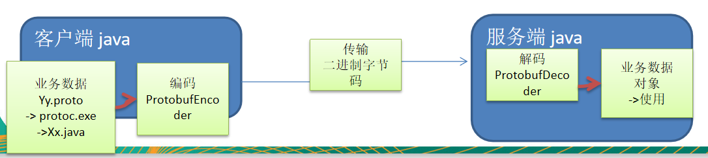

### 编码和解码的基本介绍

```text
1) 编写网络应用程序时，因为数据在网络中传输的都是二进制字节码数据，字发送数据时就需要编码，
接收数据时就需要解码。
2) codec(编码器)的组成部分有两个：decoder(解码器)和encoder(编码器)。encoder负责把业务数据
转换成字节码数据，decoder负责将字节码数据转换成业务数据。
```
### Netty本身的编码解码机制和问题分析
```text
1) Netty自身提供了一些codec(编解码器)
2) Netty提供的编解码
    StringEncoder，对字符串数据进行编码
    ObjectEncoder，对Java对象进行编码
    ...
3) Netty提供的解码器
    StringDecoder，对字符串数据进行解码
    ObjectDecoder，对Java对象进行解码
    ...
4) Netty本身自带的ObjectDecoder和和ObjectEncoder可以用来实现POJO对象或各种业务对象的编码
和解码，底层使用的仍是Java序列化技术，而Java序列化技术本身效率就不高，存在如下问题。
    无法跨语言。
    序列化后的体积太大，是二进制编码的5倍多。
    序列化性能太低。
    
解决方案：
    Google的Protobuf
```
### Protobuf
#### Protobuf基本介绍和使用示意图
```text
1) Protobuf 是 Google 发布的开源项目，全称 Google Protocol Buffers，是一种轻便高效的结构化
数据存储格式，可以用于结构化数据串行化，或者说序列化。它很适合做数据存储或 RPC(远程过程调用remote procedure call )
数据交换格式。目前很多公司http+json->tcp+protobuf
2) 参考文档 : https://developers.google.com/protocol-buffers/docs/proto  语言指南
3) Protobuf 是以 message 的方式来管理数据的.
4) 支持跨平台、跨语言，即[客户端和服务器端可以是不同的语言编写的] （支持目前绝大多数语言，例如 C++、C#、Java、python 等）
5) 高性能，高可靠性
6) 使用 protobuf 编译器能自动生成代码，Protobuf 是将类的定义使用.proto 文件进行描述。
说明，在idea 中编写 .proto 文件时，会自动提示是否下载 .ptotot 编写插件. 可以让语法高亮。
7) 然后通过 protoc.exe 编译器根据.proto 自动生成.java 文件。
8) protobuf 使用示意图
```
