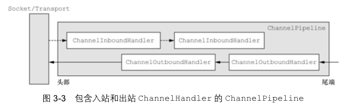
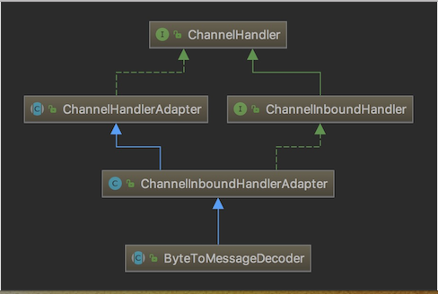
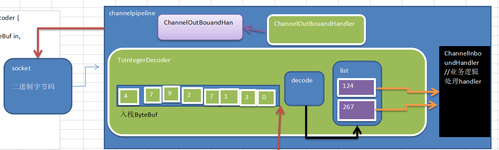
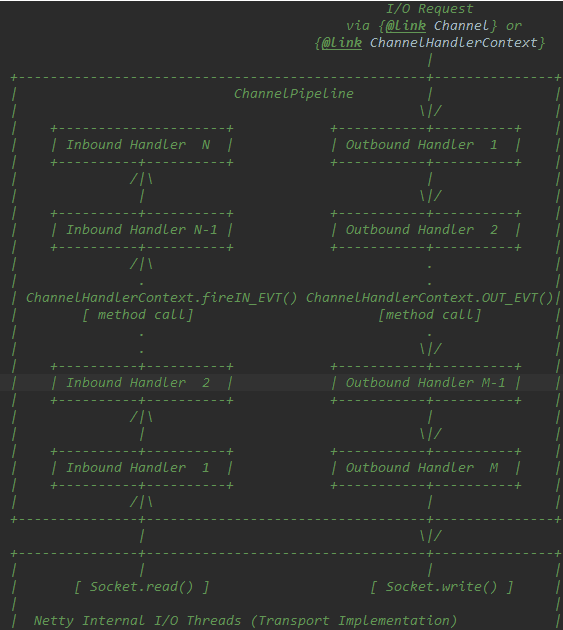
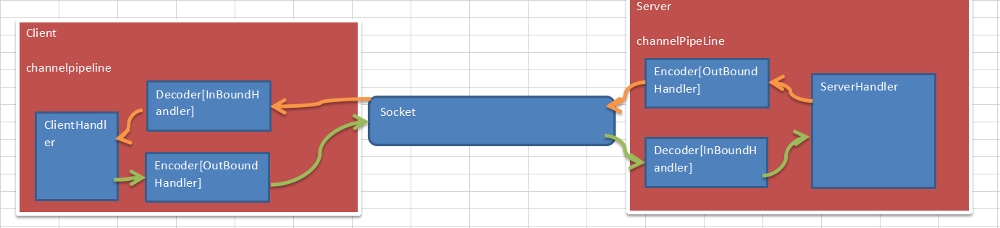
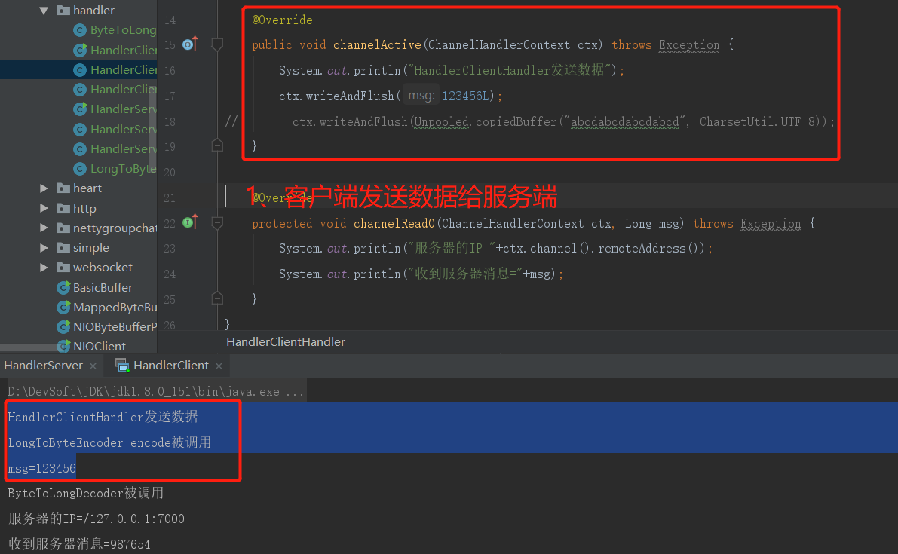
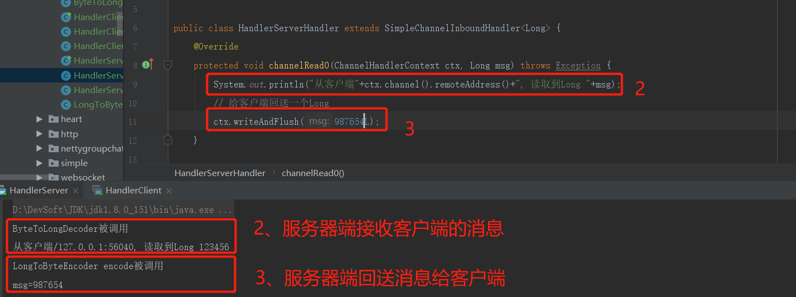
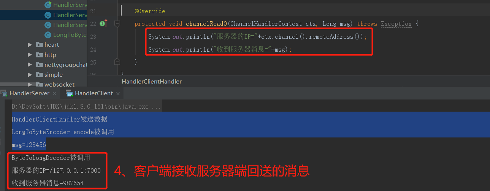

### 基本说明
```text
1) Netty组件设置：Netty的主要组件有Channel、EventLoop、ChannelHandler、ChannelPipe等
2) ChannelHandler充当了处理入站和出战数据的应用程序逻辑的容器。例如，实现ChannelInboundHandler接口
(或ChannelInboundHandlerAdapter)，你就可以接收入站事件和数据，这些数据会被业务逻辑处理。当要给客户端
发送响应时，也可以从ChannelInboundHandler冲刷数据。业务逻辑通常写在一个或者多个ChannelInboundHandler中。
ChannelOutboundHandler原理一样，只不过它是用来处理出站数据的。
3) ChannelPipeline提供了ChannelHandler链的容器。以客户端应用程序为例，如果事件的运动方向是从
客户端到服务端的，那么我们称这些事件为出站，即客户端发送给服务端的数据会通过pipeline中的一系列
ChannelOutboundHandler，并被这些Handler处理，反之则称为入站。
```


### 根据codec包理解
```text
客户端-->ProtobufEncoder-->MessageToMessageEncoder-->ChannelOutboundHandlerAdapter (出站)
服务器端<--ChannelInboundHandlerAdapter<--MessageToMessageDecoder<--ProtobufDecoder (入站)
```

### 编码解码器
```text
1) 当Netty发送或者接收一个消息的时候，就将会发生一次数据转换。入站消息会被解码：从字节转换为另一种
格式(比如java对象); 如果是出站消息，它会被编码成字节。
2) Netty提供一些列实用的编解码器，他们都实现了ChannelInboundHandler或者ChannelOutboundHandler接口。
在这些类中，channelRead方法已经被重写了。以入站为例，对于每个从入站Channel读取的消息，这个方法会被
调用。随后，它将调用由解码器所提供的decode()方法进行解码，并将已经解码的字节转换成ChannelPipeline中
的下一个ChannelInboundHandler。

解码是In，编码是Out
```
### 解码器-ByteToMessageDecoder

```text
1) 关系继承图(见上图)
2) 由于不可能知道远程节点是否会一次性发送一个完整的信息，tcp有可能出现粘包拆包的问题，这个类会对入站数据
进行缓冲，直到它准备好被处理。
3) 一个关于ByteToMessageDecoder实例分析
public class ToIntegerDecoder extends ByteToMessageDecoder {
    @Override
    protected void decode(ChannelHandlerContext ctx, ByteBuf in, List<Object> out) throws Exception {
        if (in.readableBytes() >= 4) {
            out.add(in.readInt());
        }
    }
}
说明：这个例子，每次入站从ButeBuf中读取4字节，将其解码为一个int，然后将它添加到下一个List中(decode会被多次调用)。当没有更多
元素可以被添加到该List中时，它的内容将会被发送给下一个ChannelInboundHandler，int在被添加到List中时，会被自动装箱为integer。
在调用readInt()方法前必须验证所输入的Bytebuf是否具有足够的数据。
2) decode执行分析图
```


### Netty的Handler链的调用机制
```text
案例说明：
1) 使用自定义的编码器和解码器来说明Netty的handler 调用机制
    客户端发送long -> 服务器服务端发送long -> 客户端
2) 结论：
    不论解码器Handler还是编码器Handler，接收的消息类型必须与待处理的消息类型一致，否则该Handler不会被执行。
    在解码器进行数据解码时，需要判断缓存去(Bytebuf)的数据是否足够，否则接收到的结果会跟期望的结果不一致。

```
 

    
    
        

### 其它解码器
```text
1、ReplayingDecoder
    1) public abstract class ReplayingDecoder<S> extends ByteToMessageDecoder
    2) ReplayingDecoder扩展了ByteToMessageDecoder类，使用这个类，我们不必调用readableBytes()方法。参数S指定了
    用户状态管理的类型，其中Void代表不需要状态管理。
2、LineBasedFrameDecoder：这个类在Netty内部也有使用，它使用行尾控制字符（\n或者\r\n）作为分隔符来解析数据。
3、DelimiterBasedFrameDecoder：使用自定义的特殊字符作为消息的分隔符。
4、HttpObjectDecoder：一个HTTP数据的解码器。
5、LengthFieldBasedFrameDecoder：通过指定长度来标识整包消息，这样就可以自动的处理黏包和半包消息。
```
### 出站
```text
以客户端为基准：
客户端向服务器端writeAndFlush数据时，即为出站 outBound  出站就需要编码
客户端读取服务器端发送过来的数据ChannelRead时，即为入站 inBound 入站就需要解码
```