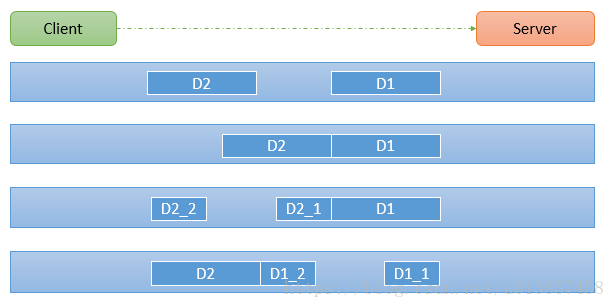
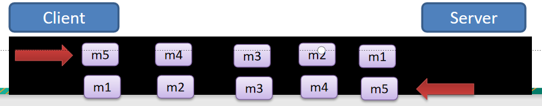

### TCP粘包和拆包基本介绍
```text
1、TCP是面向连接的，面向流的，提供高可靠性服务。收发两端(客户端和服务器端)都要有一一成对的socket。
因此，发送端为了将多个发给接收端的包，更有效的发给对方，使用了优化方法(Nagle算法)，将多次间隔较小且
数据量小的数据，合并成一个大的数据块。然后进行封包。这样做虽然提高了效率，但是接收端就难于分辨出完
整的数据包了，因为面向流的通信是无消息保护边界的。
2、由于TCP无消息保护边界，需要在接收端处理消息边界的问题，也就是我们所说的粘包、拆包问题。
3、TCP粘包、拆包图解。
    假设客户端分别发送两个数据包D1和D2给服务端，由于服务端一次读取到的字节数是不确定的，故可能存在以下四种情况。
        1)、服务端分两次读取到两个独立的数据包，分别为D1和D2，没有粘包和拆包。
        2)、服务端一次接受到两个数据包，D1和D2粘合在一起，称之为TCP粘包。
        3)、服务端分两次读取到了数据包，第一次读取到了完整的D1包和D2包的部分内容，第二次读取到了D2包剩余内容，
        这称之为TCP拆包。
        4)、服务端分两次读取到了数据包，第一次读取到了D1包的部分内容D1_1，第二次读取到了D1包剩余部分内容和完整的
        D2包。
```


### TCP粘包和拆包解决方案

```text
1、使用自定义协议+编解码器来解决
2、关键就是要解决服务器端每次读取数据长度的问题，这个问题解决，就不会出现服务器多读或少读数据的问题，从而避免TCP粘包和拆包。

具体看protocoltcp包下的实例：
通过自定义协议+编解码来实现
```
