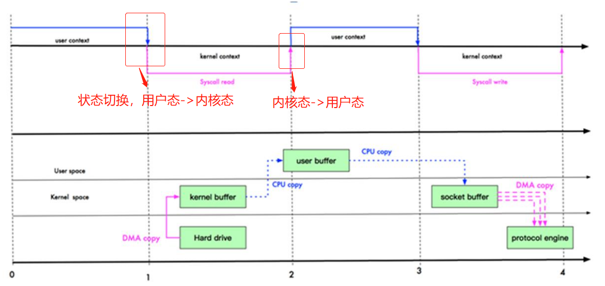
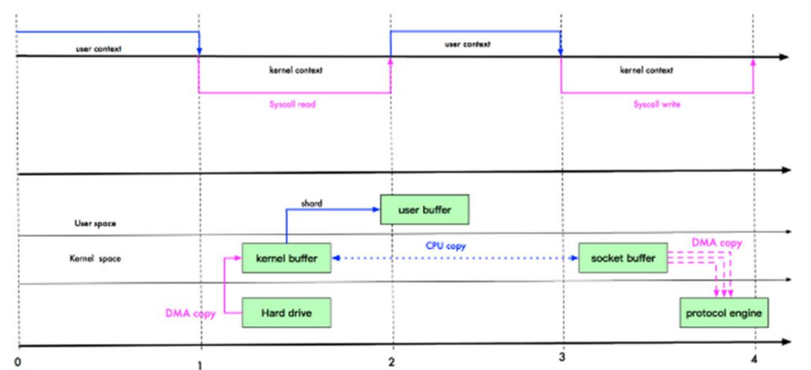
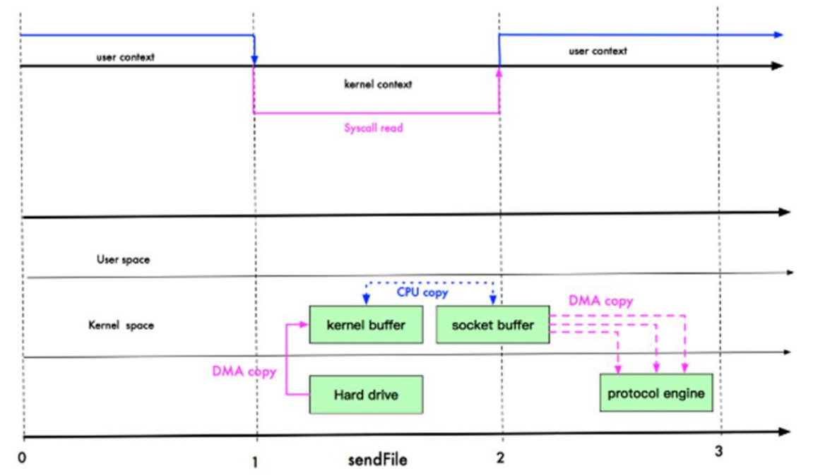
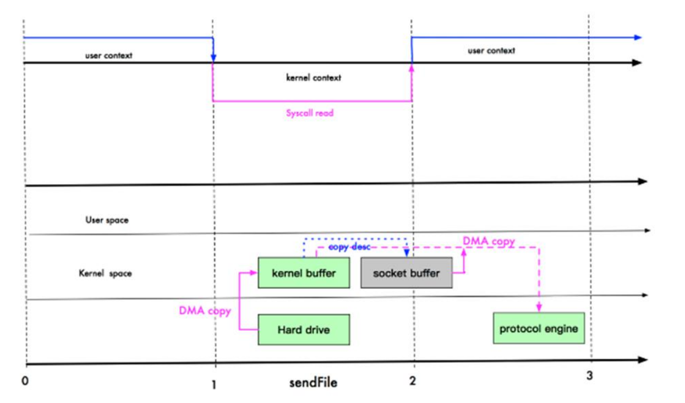

### 零拷贝基本介绍
```text
1) 零拷贝是网络编程的关键，很多性能优化都离不开。
2) 在Java编程中，常用的零拷贝有mmap(内存映射)和sendFile。
```
### 传统IO数据读写
```text
Java传统网络编程代码如下：
    File file = new File("test.txt");
    RandomAccessFile raf = new RandomAccessFile(file, "rw");
    byte[] arr = new byte[file.length()];
    raf.read(arr);
    
    Socket socket = new ServerSocket(8000).accept();
    socket.getOutputStream().write(arr);

传统IO经过了4次拷贝，3次切换。
```


### mmap优化
```text
1) mmap通过内存映射，将文件映射到内核缓冲区，同时，用户空间可以共享内核空间的数据。这样，在进行网络传输时，
就可以减少内核空间到用户空间的拷贝次数。

mmap优化后，编程3次靠欸，3次切换
```


### sendFile优化
```text
1) Linux2.1版本提供了sendFile函数，其基本原理是：数据根本不经过用户状态，直接从内核缓冲区进入到Scocket Buffer,
同时，由于和用户态完全无关，就减少了一次上下文切换。

Linux2.1 sendFile优化后3次拷贝，2次切换
```


```text
1) Linux在2.4版本中，做了一些修改，避免了从内核缓冲区拷贝到Socket buffer的操作，直接拷贝到协议栈，从而再一次减少了数据拷贝。
具体如下图。

Linux2.4 sendFile优化后2次拷贝，2次切换
PS：这里其实有一次cpu拷贝kernel buffer-->socket buffer
但是，拷贝的信息很少，比如length、offset，消耗低，可以忽略。
```


### 零拷贝再次理解
```text
1) 我们说零拷贝，是从操作系统的角度来说。因为内核缓冲区之间，没有数据的重复(只是kernel buffer有一份数据)
2) 零拷贝不仅仅带来更少的数据复制，还能带来其他性能优势，例如更少的上下文切换，更少的CPU缓存伪共享以及无CPU
校核和计算。
```